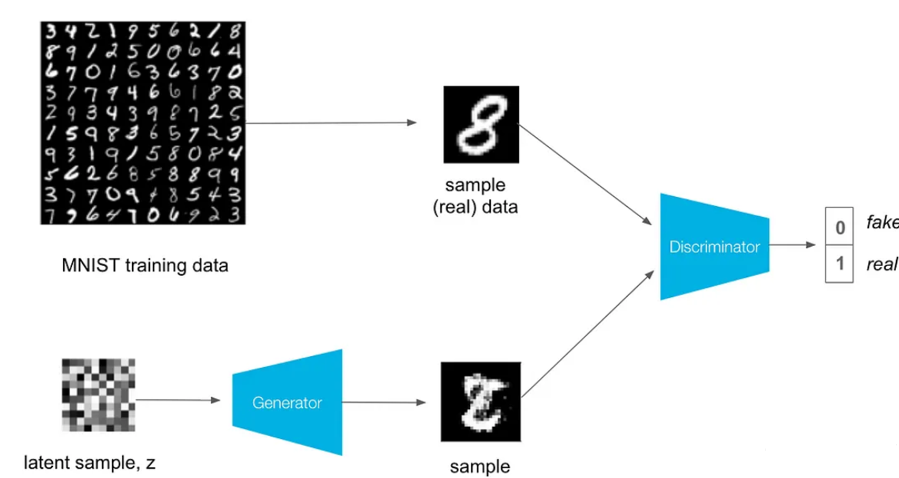

## GAN?
- Generative Adversarial Networks, or GANs, are an approach to generative modeling using deep learning methods, such as convolutional neural networks.

- It is an unsupervised learning task in machine learning that involves automatically discovering and learning the regularities or patterns in input data in such a way that the model can be used to generate or output new examples that plausibly could have been drawn from the original dataset.

## MNIST Dataset
- The MNIST database (Modified National Institute of Standards and Technology database) is a large database of handwritten digits that is commonly used for training various image processing systems.

- The database is also widely used for training and testing in the field of machine learning.

## How The Model Works

